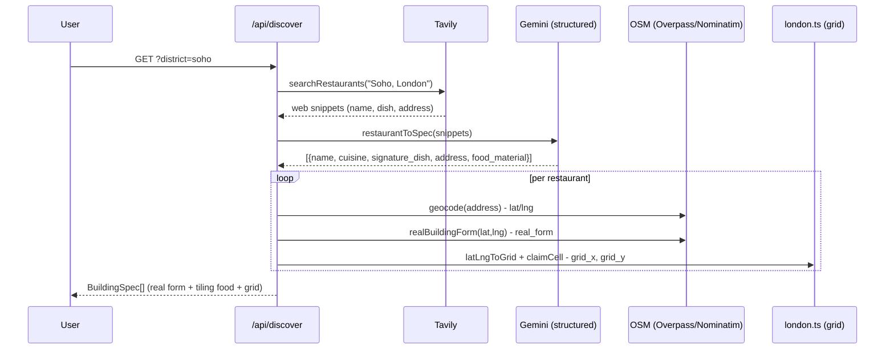
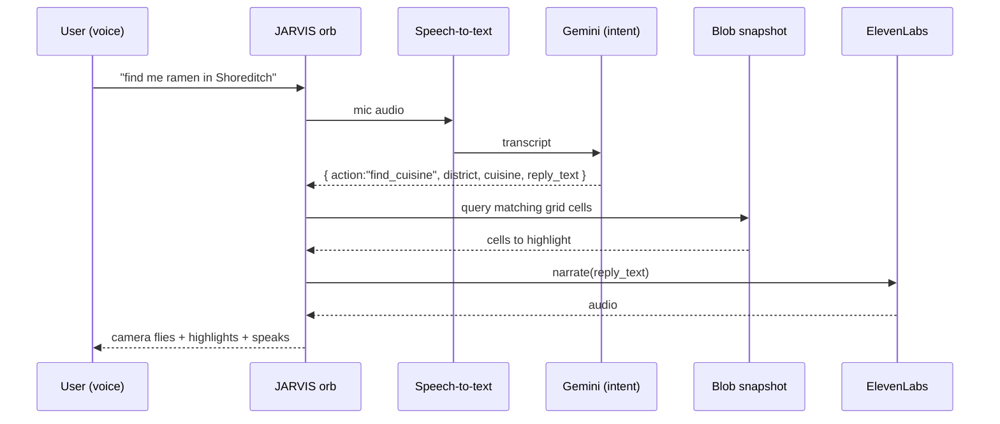

# 🍣 Foodscape

> **An [isometric.nyc](https://isometric.nyc/) for London — built out of food.**
> Every tile is the **real building** at that London spot (its actual massing, storeys,
> roofline, footprint) **re-skinned in the signature food** of the best restaurant there —
> a real Soho townhouse rebuilt out of sushi, a Victorian terrace re-skinned as spaghetti,
> a railway arch made of tacos. All rendered in one coherent **retro pixel-art isometric**
> style. And it's not a one-shot generator — it's an **autonomous agent** that keeps the
> food-city true to the real world.

---

## What it does

1. **Pick a London district** (Soho, Shoreditch, Camden, Mayfair, Brixton).
2. **Tavily** searches the live web for that district's best restaurants — name, cuisine,
   signature dish, address.
3. Each restaurant's **real building** is resolved from OpenStreetMap (footprint + storeys
   + roofline) and **Gemini** turns it into a structured tile spec, choosing a *tiling food
   material* for the re-skin.
4. **Nano Banana** (Gemini's image model) renders each building as a pixel-art isometric tile,
   keeping the real silhouette but re-skinning every surface in food — anchored to a single
   locked style reference so the whole city looks coherent.
5. Tiles composite onto an isometric grid in the browser → a living food-city.
6. **JARVIS**, a floating voice orb, lets you talk to the map ("take me to Soho", "find me
   ramen") and replies out loud via **ElevenLabs**.
7. **The autonomous agent** re-runs the search on a schedule, diffs against what it already
   built, and regenerates only the tiles that changed — narrating the diff in voice.

---

## 🏆 Sponsor technology

Foodscape is built on three sponsor platforms, each load-bearing:

### 1. Google DeepMind — Nano Banana + Gemini
The generative core. Used in **three** distinct ways via [`@google/genai`](https://www.npmjs.com/package/@google/genai):

| Use | Model | Where |
|---|---|---|
| **Tile image generation** (the whole visual) | `gemini-2.5-flash-image` (Nano Banana) | `lib/gemini.ts → generateImage()` |
| **Structured restaurant extraction** — turn messy web snippets into typed specs + pick a tiling food material | `gemini-2.5-flash` + `responseSchema` (structured output) | `lib/gemini.ts → restaurantToSpec()` |
| **Agent + JARVIS reasoning** — diff/refresh decisions and voice-intent parsing | `gemini-2.5-flash` | `lib/agent.ts`, `api/jarvis/route.ts` |

The **style + form lock** is the key trick: one style-anchor image (`public/style-anchor.png`)
is fed into *every* Nano Banana call alongside a real-building descriptor, so N independent
image-gen calls produce one coherent isometric world where each building stays recognizably real.

### 2. Tavily — live web grounding
[`@tavily/core`](https://www.npmjs.com/package/@tavily/core) provides the real-world signal.
`lib/tavily.ts → searchRestaurants(district)` runs an advanced web search per district for the
best restaurants and their signature dishes. This is what makes the city **real and current** —
and what the autonomous agent re-runs to detect change (a new top spot, a closure, a new dish).

### 3. ElevenLabs — the voice of JARVIS
[`@elevenlabs/elevenlabs-js`](https://www.npmjs.com/package/@elevenlabs/elevenlabs-js) gives the
orb its voice. `api/narrate/route.ts` turns JARVIS replies and the agent's change feed into
speech ("Kiln overtook Bao on Brewer Street"), making the orb both the navigation UX and the
agent's narrator.

> Persistence is **Vercel Blob** (private store `foodlondon`): district snapshots as JSON +
> tile PNGs served through a token-authenticated proxy route.

---

## How it works

### System architecture


### Discover pipeline (district → specs)



### The autonomous agent loop


### JARVIS voice loop



---

## Tech stack

- **Framework:** Next.js 16 (App Router, `src/`, TypeScript, Tailwind, Turbopack)
- **Generative AI:** `@google/genai` — Nano Banana (`gemini-2.5-flash-image`) + Gemini (`gemini-2.5-flash`)
- **Web grounding:** `@tavily/core`
- **Voice:** `@elevenlabs/elevenlabs-js`
- **Real buildings:** OpenStreetMap Overpass + Nominatim (no API key)
- **Persistence:** Vercel Blob (private store)
- **Map:** MapLibre GL + custom isometric compositing
- **Deploy:** Vercel

## Project layout

```
src/
├── app/
│   ├── page.tsx                  # landing -> London food-city viewer
│   └── api/
│       ├── discover/route.ts     # Tavily -> restaurants -> Gemini specs   [done]
│       ├── generate/route.ts     # Nano Banana tile gen -> Blob            (Phase 3)
│       ├── tile/.../route.ts     # private-Blob tile proxy                 (Phase 3)
│       ├── refresh/route.ts      # autonomous agent: refresh + diff        (Phase 4)
│       ├── jarvis/route.ts       # voice intent -> action                  (Phase 5)
│       └── narrate/route.ts      # ElevenLabs TTS                          (Phase 5)
├── lib/
│   ├── tavily.ts · gemini.ts · style-anchor.ts · buildings.ts            [done]
│   ├── discover.ts · london.ts                                           [done]
│   └── store.ts · isometric.ts · agent.ts · elevenlabs.ts               (Phase 3-5)
└── public/style-anchor.png       # the locked pixel-art style reference   [done]
```

See [`PLAN.md`](./PLAN.md) for the full phased build plan.

## Getting started

```bash
npm install

# .env.local (gitignored) — server-side only:
#   GOOGLE_API_KEY=          # Google AI Studio
#   TAVILY_API_KEY=          # app.tavily.com
#   ELEVENLABS_API_KEY=      # elevenlabs.io  (ELEVENLABS_VOICE_ID optional)
#   BLOB_READ_WRITE_TOKEN=   # Vercel Blob store "foodlondon"

npm run dev          # http://localhost:3000

# Try the discover pipeline directly (no server needed):
node --conditions=react-server --env-file=.env.local --import tsx scripts/test-discover.ts soho
```

> Scripts that import server libs need the `--conditions=react-server` flag — `lib/env.ts`
> imports `server-only`, which throws in a plain Node process; that flag resolves it to a no-op.
